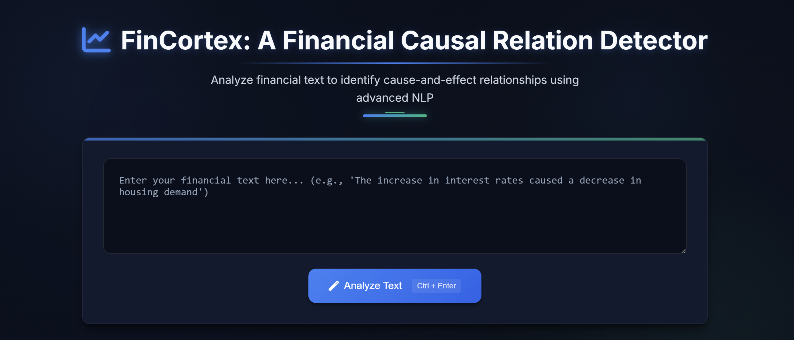
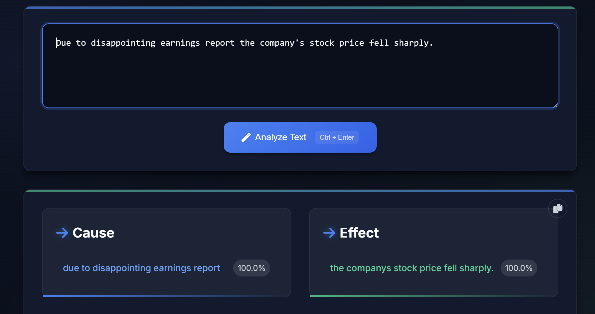

# FinCortex: Decoding Cause and Effect in Financial Narratives

FinCortex is an AI-powered NLP system that automatically detects, extracts, and interprets causal relationships in unstructured financial text. Designed for financial analysts, investors, and decision-makers, it transforms raw textual data into structured insights, enabling more effective, data-driven decisions.

## 🚀 Project Highlights

- **Automatic Causal Extraction**: Identifies cause-effect pairs from financial documents like earnings reports, analyst notes, and market news.
- **Deep Learning Architecture**: Uses a multi-task BiLSTM + Multi-Head Attention model for span detection and causal relation classification.
- **Web Interface**: Real-time causal analysis through an intuitive front-end.
- **Domain-Specific Design**: Trained on curated financial datasets tailored for industry-specific language.

---

## 🧠 Problem Statement

Financial documents often embed valuable cause-and-effect relationships in complex language, making them:
- Hard to extract manually
- Time-consuming and error-prone
- Inefficient for large-scale processing

**FinCortex** solves this by automating causal relationship extraction and presenting structured outputs for faster insights.

---

## 🎯 Objectives

- Develop a system that identifies cause and effect spans within financial text.
- Determine the directionality of the relationship (cause → effect or effect → cause).
- Improve accuracy using financial-specific preprocessing.
- Offer a user-friendly web interface for real-time analysis.

---

## 🛠️ Methodology

### Preprocessing
- Lowercasing and normalization (e.g., converting “25.4%” → “25.4 percent”)
- Tokenization, indexing, padding, and attention mask creation

### Model Architecture
- Custom 300-dimensional embeddings
- 3-layer **Bidirectional LSTM**
- 8-head **Multi-Head Attention**
- Span prediction heads for cause/effect boundary detection
- Relation classifier for determining causal direction

### Training
- Optimizer: AdamW  
- Learning Rate: 2e-5  
- Epochs: 20  
- Loss: Weighted binary cross-entropy  

### Deployment
- **Backend**: Flask (Python)
- **Frontend**: JavaScript, HTML, CSS
- Real-time input and output visualization

---

## 📊 Dataset

- **20,000 labeled samples**
  - 20% real financial text (from competition data)
  - 80% synthetic samples to enhance generalization
- Structure:
  - Raw sentence
  - Labeled cause span
  - Labeled effect span
  - Directionality label
- Split: 70% Train / 10% Validation / 20% Test

---

## 🔁 Workflow

1. User submits financial text via the web interface.
2. Backend handles preprocessing and feeds input into the model.
3. Model returns:
   - Start and end positions for cause and effect
   - Direction of the causal link
4. Frontend displays highlighted results for easy interpretation.

---

## 📈 Implementation

Example:
- **Input**: Due to disappointing earnings report the company's stock price fell sharply.
- **Cause**: "Due to disappointing earnings report"
- **Effect**: "the companys stock price fell sharply"
- **Relation**: Cause → Effect

- Below are two implementation screenshots demonstrating the model's output:

  
 
  

---

## 📎 Future Enhancements

- Multilingual support
- Real-time market data integration
- Improved handling of ambiguous or multi-causal statements

---

## 📜 License

This project is shared for educational and demonstrative purposes. Commercial use or redistribution requires permission.
